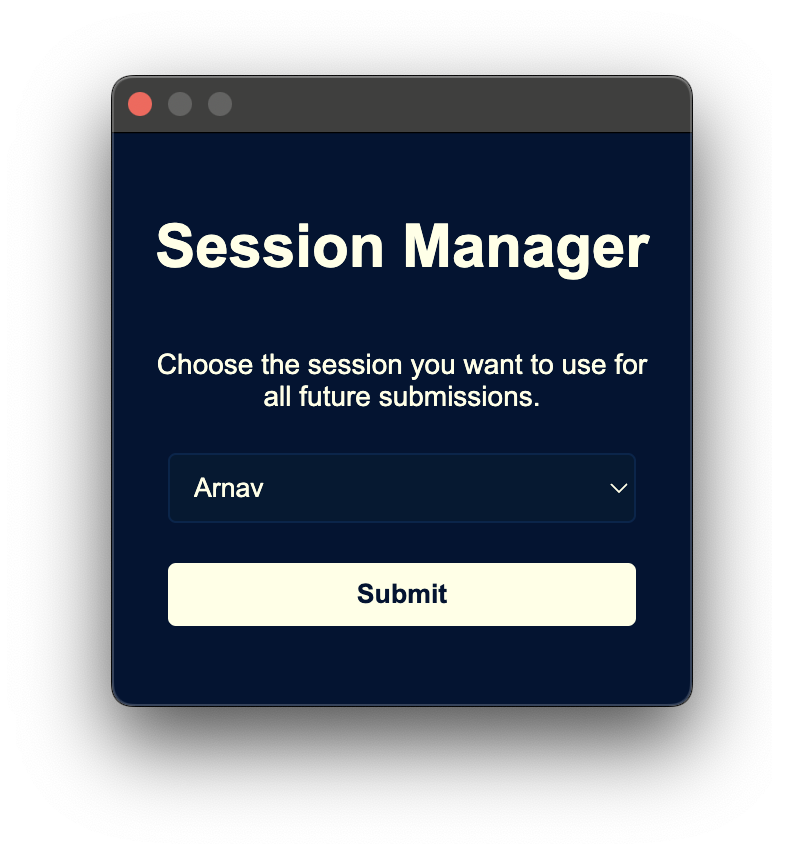

# LeetShare 🎉

Easily manage your shared LeetCode premium accounts.

## About 📖

LeetShare is a nifty tool for tech enthusiasts who pool resources to access LeetCode's premium content. It's all fun and games until you realize that using the same account simultaneously messes with everyone's sessions. That's where LeetShare comes in! This extension is your behind-the-scenes hero, ensuring that when you hit that submit button, it's your session that gets the credit, not your buddy's. Say goodbye to the frustration of session mix-ups and hello to seamless coding sessions. Whether you're tackling daily challenges or grinding through interview prep, LeetShare keeps your focus on the code, not the logistics.

## Why Manifest v2? 🛠️

I chose Manifest v2 because v3 is a pain in the ass and doesn't let me block requests (we need to block requests to `/submit` so that we can send the session switching request first). In short, v2 keeps things simple and straightforward, letting us do what we need without the extra headache. It's all about keeping the coding flow smooth and stress-free.

## Installation 🚀

1. Download this repository or clone it.
2. Open `chrome://extensions` in your Chromium-based browser.
3. Enable 'Developer mode' at the top-right.
4. Click 'Load unpacked' and select the LeetShare directory.
5. You're all set!

## Contribute 💖

Found LeetShare helpful? Give us a star and share with friends!

Share the load, not the code! 😉
